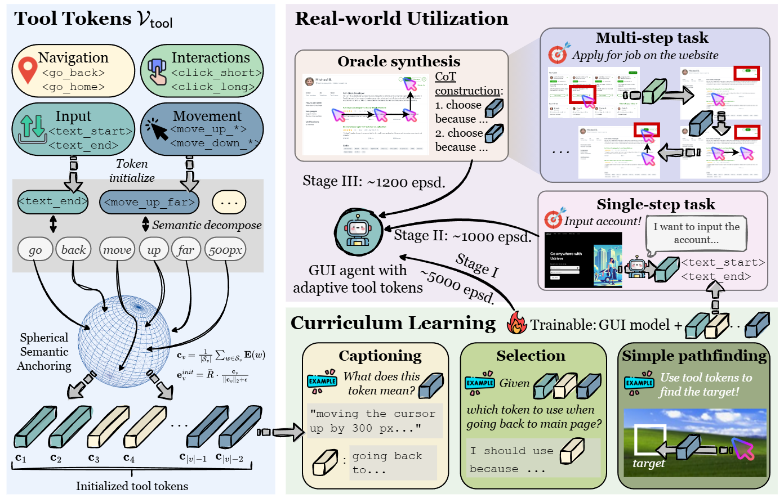
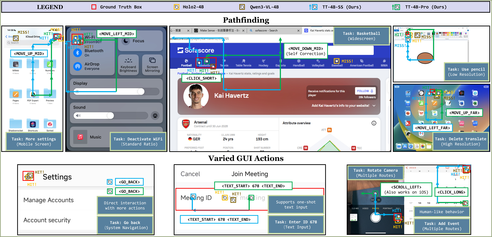
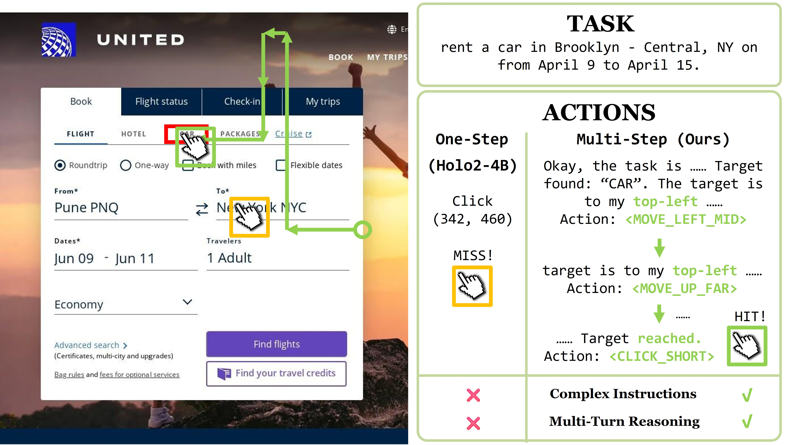

# ToolTok: Tool Tokenization for Efficient and Generalizable GUI Agents

## Description







## Train (You might want to setup accelerate)

``` shell
pip install -r requirements.txt
python -m src.utils.generate_data
python -m src
```

If you train with ``python``, you need to set ``device_map = "auto"`` in all training scripts. Training scripts can be found in ``src/train``. Currently we use ``sft.py`` for stage I training, ``sft2.py`` for stage II training, and ``sft3.py`` for stage III training.

If your machine cannot handle 4K resolution images, please refer to ``src/utils/sft_screenspot_pro.py`` for downsample options.

## Inference

``` shell
python -m src.eval.evaluate
```

You should setup testing in ``src.eval.evaluate`` before processing. Select testing dataset on top by un-commenting the desired data collator. Use ```grounding_baseline`` to test ``Qwen3-VL`` based **visual grounding** models. Use ``api_baseline`` to test ``Qwen3-VL`` based **zero shot pathfinding** models. Use ``trained`` to test our models.

Additionally, if you want to test ``Holo2-4B`` or locally provided ``Qwen3-VL-4B``, refer to ``src/eval/eval_holo2.py``. Usage is similar to ``evaluate.py``.
